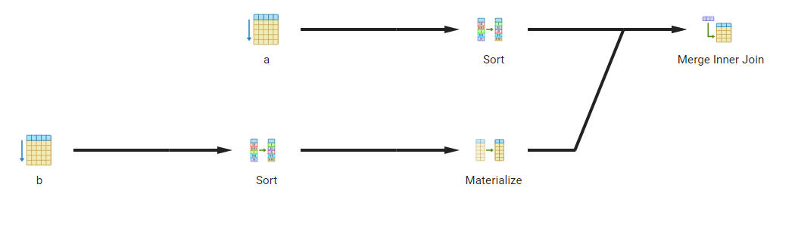

# Homework B - Wisconsin Benchmark

## Section 1

1. `A.pk = B.pk`
   1. 
   **Query:**
   ```sql
   SELECT *
   FROM A JOIN B USING(pk)
   ```
   **Results:**

   
   2.
   **Query:**
    ```sql
   SELECT pk
   FROM A JOIN B USING(pk)
   ```
   **Results:**
   

2. `A.ht = B.ht`
    1.
   **Query:**
   ```sql
   SELECT *
   FROM A JOIN B USING(ht)
   ```
   **Results:**
   

    2.
   **Query:**
    ```sql
   SELECT ht
   FROM A JOIN B USING(ht)
   ```
   **Results:**
   

3. `A'.ht = B'.ht`
    1.
   **Query:**
   ```sql
   SELECT *
   FROM Aprime JOIN Bprime USING(ht)
   ```
   **Results:**
   

    2.
   **Query:**
    ```sql
   SELECT ht
   FROM Aprime JOIN Bprime USING(ht)
   ```
   **Results:**
   

4. `A.ten = B.ten`
    1.
   **Query:**
   ```sql
   SELECT *
   FROM A JOIN B USING(ten)
   ```
   **Results:**
   

    2.
   **Query:**
    ```sql
   SELECT ten
   FROM A JOIN B USING(ten)
   ```
   **Results:**
   

5. `A'.ten = B'.ten`
    1.
   **Query:**
   ```sql
   SELECT *
   FROM Aprime JOIN Bprime USING(ten)
   ```
   **Results:**
   

    2.
   **Query:**
    ```sql
   SELECT ten
   FROM Aprime JOIN Bprime USING(ten)
   ```
   **Results:**
   

6. `A.ht = B.ten`
    1.
   **Query:**
   ```sql
   SELECT *
   FROM A JOIN B ON A.ht = B.ten
   ```
   **Results:**
   

    2.
   **Query:**
    ```sql
   SELECT A.ht, B.ten
   FROM A JOIN B ON A.ht = B.ten
   ```
   **Results:**
   

7. `B.ten = A.ht`
   1.
   **Query:**
   ```sql
   SELECT *
   FROM B JOIN A ON B.ten = A.ht
   ```
   **Results:**
   

    2.
   **Query:**
    ```sql
   SELECT B.ten, A.ht 
   FROM B JOIN A ON B.ten = A.ht
   ```
   **Results:**
   

8. `A.ht = B'.ten`
    1.
   **Query:**
   ```sql
   SELECT *
   FROM A JOIN Bprime ON A.ht = Bprime.ten
   ```
   **Results:**
   

    2.
   **Query:**
    ```sql
   SELECT A.ht, Bprime.ten
   FROM A JOIN Bprime ON A.ht = Bprime.ten
   ```
   **Results:**
   

9. `B'.ten = A.ht`
   1.
   **Query:**
   ```sql
   SELECT *
   FROM Bprime JOIN A ON Bprime.ten = A.ht
   ```
   **Results:**
   

   2.
   **Query:**
    ```sql
   SELECT Bprime.ten, A.ht
   FROM Bprime JOIN A ON Bprime.ten = A.ht
   ```
   **Results:**
   

10. `A.ht = B.ht = C.ht`
    1.
       **Query:**
       ```sql
       SELECT *
       FROM A JOIN B USING(ht) JOIN C USING(ht)
       ```
       **Results:**
       
    2.
       **Query:**
        ```sql
       SELECT ht
       FROM A JOIN B USING(ht) JOIN C USING(ht)
       ```
       **Results:**
       

11. `A.ten = B.ten = C.ten`
    1. **Query:**
       ```sql
       SELECT *
       FROM A JOIN B USING(ten) JOIN C USING(ten)
       ```
       **Results:**
       

    1.
       **Query:**
        ```sql
       SELECT ten
       FROM A JOIN B USING(ten) JOIN C USING(ten)
       ```
       **Results:**
       

12. They did produce different plans. `ten` and `hund` had the same plan. `ht`, `tt`, and `ot` all had the same plan.
The threshold seems to be between hundreds and thousands.

13. `A.pk = B.ht = C.ht`
    1.
       **Query:**
       ```sql
       SELECT *
       FROM A JOIN B ON A.pk = B.ht JOIN C ON B.ht = C.ht
       ```
       **Results:**
       
    1.
       **Query:**
       ```sql
       SELECT A.pk, B.ht, C.ht
       FROM A JOIN B ON A.pk = B.ht JOIN C ON B.ht = C.ht
       ```
       **Results:**
       

14. `A.pk = B.ten = C.ten`
    1.
       **Query:**
       ```sql
       SELECT *
       FROM A JOIN B ON A.pk = B.ten JOIN C ON B.ten = C.ten
       ```
       **Results:**
       

    1.
       **Query:**
        ```sql
       SELECT A.pk, B.ten, C.ten
       FROM A JOIN B ON A.pk = B.ten JOIN C ON B.ten = C.ten
       ```
       **Results:**
       

15. They were different. (14) used a nested loop join but (13) used a hash join. All of `ot`, `tt`, and `hund` also used
a nested loop join. The only one that used the hash join was `ht`. The cutoff seems to be somewhere in between
hundreds of thousands and tens of thousands.

16. `A’.ht = B’.ht = C’.ht`
    1.
       **Query:**
       ```sql
       SELECT *
       FROM Aprime JOIN Bprime USING(ht) JOIN Cprime USING(ht)
       ```
       **Results:**
       

    2.
       **Query:**
       ```sql
       SELECT ht
       FROM Aprime JOIN Bprime USING(ht) JOIN Cprime USING(ht)
       ```
       **Results:**
       

17. `A’.ten = B’.ten = C’.ten`
    1.
       **Query:**
       ```sql
       SELECT *
       FROM Aprime JOIN Bprime USING(ten) JOIN Cprime USING(ten)
       ```
       **Results:**
       

    2.
       **Query:**
        ```sql
       SELECT ten
       FROM Aprime JOIN Bprime USING(ten) JOIN Cprime USING(ten)
       ```
       **Results:**
       

18. They produce the same plan.

19. `Big`
    1.
       **Query:**
       ```sql
       SELECT *
       FROM A 
       JOIN Bprime
        ON A.ht = Bprime.hund
       JOIN C
        ON Bprime.ten = C.ot
       JOIN Aprime
        ON Aprime.ten = A.ht
       JOIN Cprime
        ON Aprime.ht = Cprime.ot AND Aprime.ht = Cprime.ot
       JOIN B
        ON B.pk = Cprime.hund
       ```
       **Results:**
       

    1.
       **Query:**
       ```sql
       SELECT A.ht, Bprime.hund, Bprime.ten, C.ot, Aprime.ten, Cprime.ot, B.pk, Cprime.hund
       FROM A 
       JOIN Bprime
       ON A.ht = Bprime.hund
       JOIN C
       ON Bprime.ten = C.ot
       JOIN Aprime
       ON Aprime.ten = A.ht
       JOIN Cprime
       ON Aprime.ht = Cprime.ot
       JOIN B
       ON B.pk = Cprime.hund
       ```
       **Results:**
       

20. `Complex`
    1.
       **Query:**
       ```sql
       SELECT *
       FROM A
       JOIN Aprime
        ON A.ht < Aprime.ten AND Aprime.ten = 5
       JOIN Cprime
        ON Aprime.ht = Cprime.ot 
       JOIN B
        ON B.pk = Cprime.hund AND B.ot < 500
       ```
       **Results:**
       

    1.
       **Query:**
       ```sql
       SELECT A.ht, Aprime.ten, Aprime.ht, Cprime.ot, B.pk, Cprime.hund
       FROM A
       JOIN Aprime
       ON A.ht < Aprime.ten AND Aprime.ten = 5
       JOIN Cprime
       ON Aprime.ht = Cprime.ot 
       JOIN B
       ON B.pk = Cprime.hund AND B.ot < 500
       ```
       **Results:**
       